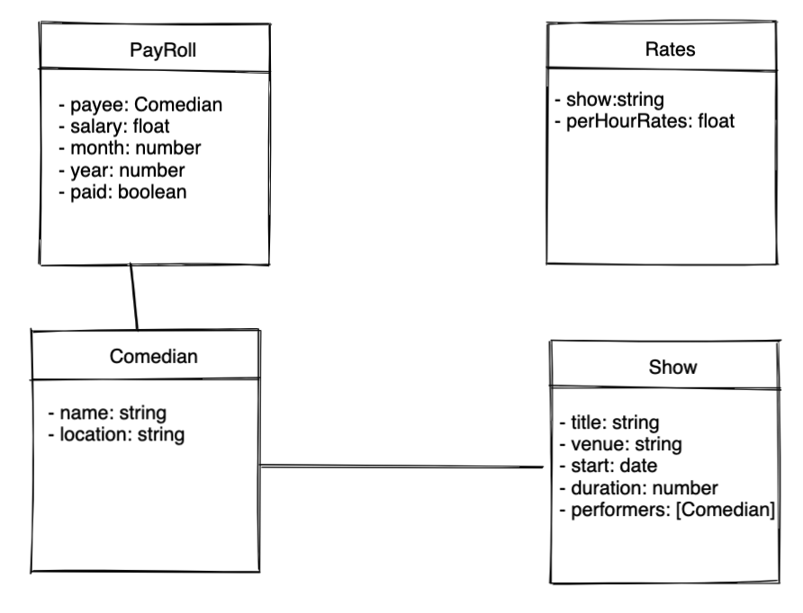

# Project Setup 

## Database Setup

In your mongosh, run these commands:

```sh
use learn # the database
db.createCollection("comedians") # the collections
db.createCollection("shows") 
db.createCollection("rates")
db.createCollection("payrolls")
```

## Quick Start

```sh
npm i
npm run clear # clear database (use when needed)
npm run seed # seed data (Comedian, Show, Rates)
npm start
```

> This application will exit after execution.

## Schedule for Remaining Lessons

|Date|Topic|
|-|-|
|24 Nov (Thu) |Create and Read API|
|26 Nov (Sat) |Update and Delete API, Work on plants API homework with students|
|29 Nov (Tue) |Explore more use cast for CRUD API|
|01 Dec (Thu) |Passport|
|03 Dec (Sat) |React + API, Deploy (not sure is it still heroku)|
|5 Dec (Mon) |Start Project (total 3 weeks)|

## Lesson (Tue, 29 Nov 2022)

Refer to the `Quick Start` for seeding commands.

Agenda:
1. Two additional collections: `Rates` and `PayRoll`.
1. Use of Express Router
1. Use of additional service tier



Endpoints:

|#|Url|Verb|Remarks|
|-|-|-|-|
|1|/assign/:showId/:comedianId|POST|It should assign a comedian to a show. Check for duplicate. Check if comedian exist.|
|2|/assign/:showId/:comedianId|DELETE|It should remove the specified comedian out of the show. Check if comedian does exist as performers.|
|3|/generatepayroll/:month/:year|POST|Create document(s) in the `PayRoll` collection. Check against `Rates` to determine how much salary a comedian is going to get for the month/year. Filter `Show` collection based on the `start` date. This endpoint is assumed to be called on the first day of the month.|

Consider returning these statuses:

|Status Code | Reason|
|-|-|
|200 ok|general success status. read, update or delete success should return this.|
|201 created|create success should return this|
|400 bad request|return when inputs are insufficient or wrong|
|409 conflict|return this status when there is a conflict. such as a failed update operation|
|500 internal server error | return this for any unexpected error|

[HTTP Status Code](https://en.wikipedia.org/wiki/List_of_HTTP_status_codes)
